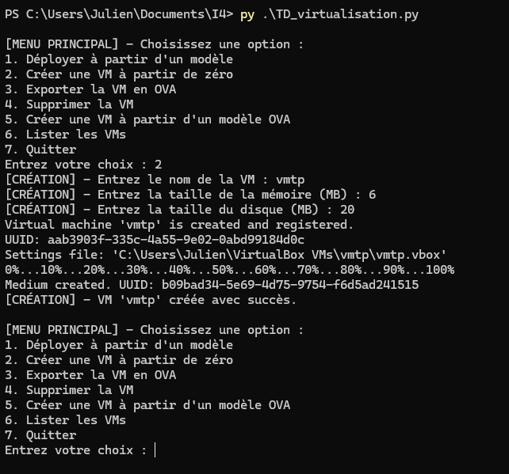
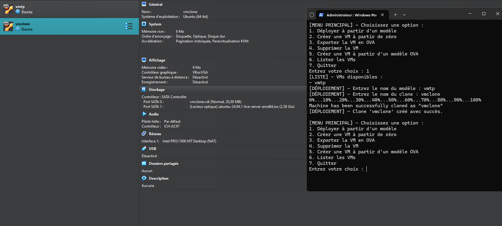
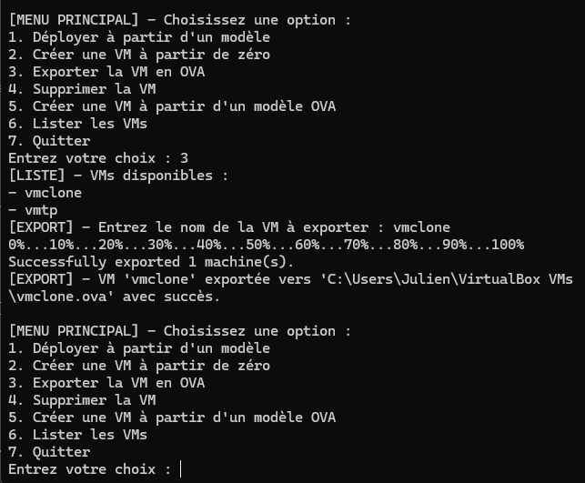
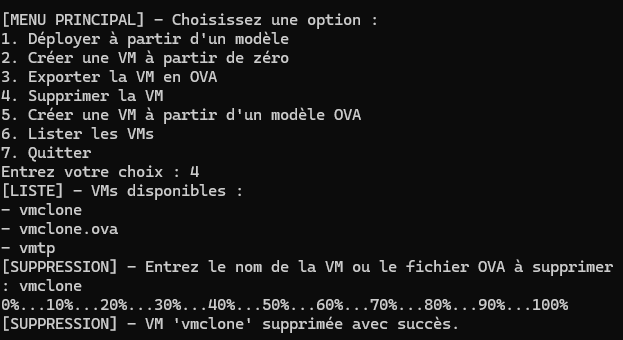
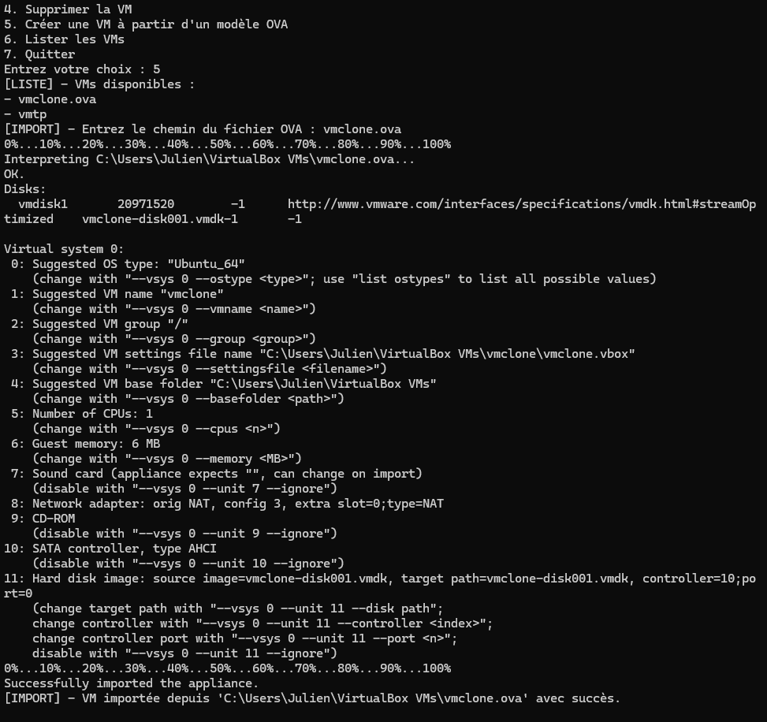
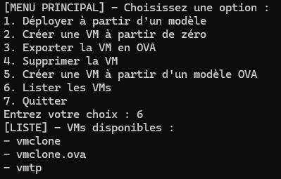

# TD Virtualisation Project

Ce projet gère les machines virtuelles avec VirtualBox.

## Fonctionnalités Principales
- Création de VM à partir de zéro
- Déploiement de VMs à partir de modèles
- Exportation et importation de fichiers OVA
- Suppression de machines virtuelles et de fichiers OVA
- Liste des VMs disponibles

---

## Captures d'écran

### 1. Création de VM à partir de zéro

### 2. Clone de VM

### 3. Export en modèle OVA

### 4. Suppression d'une VM

### 5. Création à partir d'un modèle OVA

### 6. Liste des VMs disponibles

---

## ⚠️ Disclaimer
Si vous souhaitez cloner ou utiliser ce projet, **veillez à redéfinir les chemins** (`VM_PATH` et `ISO_PATH`) dans le fichier `TD_virtualisation.py` pour correspondre à votre environnement local. Cela garantira le bon fonctionnement du script.
